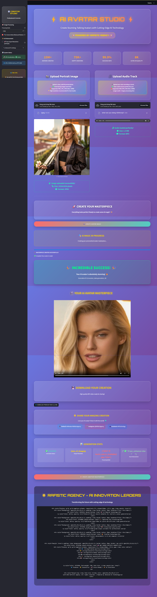

<div align="center">

# 🎭 SadTalker

### AI Talking Head Animation & Avatar Generation from Portrait + Audio

<p>


</p>

Generate realistic talking head animations from a single portrait image and audio input<br/>using 3D motion coefficients, GFPGAN face restoration, and custom web interfaces.

</div>

---

## Overview

**SadTalker** is an audio-driven generative AI pipeline that animates static portrait images into realistic talking avatars synchronized to spoken audio. The system extracts speech acoustic features, models stylized 3D head and expression coefficients, and synthesizes motion-mapped video frames.

To ensure photorealistic quality, the pipeline integrates **GFPGAN** face enhancement to restore facial details and sharpness across multiple output resolutions (256×256 and 512×512).

## Web Application Interface

The project includes an interactive web interface for avatar creation:

<div align="center">

</div>

## Pipeline Architecture

```
┌──────────────┐    ┌──────────────────┐    ┌────────────────┐
│   Portrait   │───▶│  Facial Landmark │    │                │
│   Image      │    │  & 3D Coeffs     │───▶│  Motion-Driven │
│              │    │                  │    │  Head Video    │
│   Audio      │───▶│  Wav2Vec Acoustic│    │                │
│   File       │    │  Lip Sync Model  │    └───────┬────────┘
└──────────────┘    └──────────────────┘            │
                                                    ▼
                                            ┌────────────────┐
                                            │  GFPGAN Face   │
                                            │  Restoration   │
                                            └───────┬────────┘
                                                    │
                                                    ▼
                                            ┌────────────────┐
                                            │  Final Video   │
                                            │  (.mp4 / 60fps)│
                                            └────────────────┘
```

## Features

- **Single-Image Avatar Generation** — Generate natural conversational video from a single static portrait photo
- **Precise Lip Synchronization** — Speech-driven phoneme-to-viseme mouth motion alignment
- **GFPGAN Detail Restoration** — Super-resolution face restoration removing blending artifacts and enhancing facial features
- **Motion & Pose Controls** — Adjustable pose parameters, expression weights, and head tilt dynamics
- **Multiple Interface Options** — Full web UI available via Streamlit (`launcher.py`) and Gradio (`app_sadtalker.py`)
- **Containerized Deployment** — `cog.yaml` configured for cloud GPU deployment via Replicate

## Tested System Benchmarks

Benchmarked on local workstation:

| Specification | Value |
|:---|:---|
| **CPU** | Intel Core i7-14700KF (20 cores, 28 threads) |
| **GPU** | NVIDIA GeForce RTX 3080 (10GB GDDR6X) |
| **RAM** | 16GB DDR5 (5600 MHz) |
| **Resolution** | 512×512 |
| **Processing Speed** | ~2–3 minutes for 30s audio sequence |
| **GPU Utilization** | 90–100% CUDA load |

## Tech Stack

| Component | Technology |
|:---|:---|
| **Language** | Python 3.10 |
| **Deep Learning** | PyTorch, TorchVision, Torchaudio |
| **Face Restoration** | GFPGAN |
| **Audio Processing** | Librosa, PyDub, SciPy, Resampy |
| **Computer Vision** | OpenCV, Face Alignment, Kornia |
| **Web Frameworks** | Streamlit, Gradio |
| **Deployment** | Cog (Replicate containerization) |

## Project Structure

```
SadTalker/
├── app_sadtalker.py           # Gradio web interface
├── inference.py               # Core inference execution script
├── launcher.py                # Environment check & Streamlit application launcher
├── predict.py                 # Cog Replicate prediction endpoint
├── requirements.txt           # Verified dependency requirements
├── cog.yaml                   # Containerized deployment manifest
├── AI Avatar Creator Application.txt  # System architecture & benchmark docs
├── src/                       # Motion synthesis and face rendering modules
├── gfpgan/                    # GFPGAN face restoration weights & architecture
├── results/                   # Generated video outputs and UI screenshots
└── TEST-UI/                   # UI verification assets
```

## Getting Started

### Prerequisites

- Python 3.10.x recommended
- NVIDIA GPU with CUDA support and at least 6GB VRAM

### Installation

```bash
# Clone the repository
git clone https://github.com/rafay-byte/SadTalker.git
cd SadTalker

# Install dependencies
pip install -r requirements.txt
```

### Usage

```bash
# 1. Launch the Streamlit Web UI
python launcher.py

# 2. Or launch the Gradio interface
python app_sadtalker.py

# 3. Or run command-line inference
python inference.py --driven_audio <audio.wav> --source_image <portrait.jpg> --enhancer gfpgan
```

## Acknowledgements & Citations

This implementation builds upon the foundational research in audio-driven talking face animation:

```bibtex
@article{zhang2023sadtalker,
  title={SadTalker: Learning Realistic 3D Motion Coefficients for Stylized Audio-Driven Single Image Talking Face Animation},
  author={Zhang, Wenxuan and Cun, Xiaodong and Wang, Xuan and Zhang, Yong and Shen, Xi and Guo, Yuandong and Shan, Ying and Wang, Fei},
  journal={arXiv preprint arXiv:2211.12194},
  year={2023}
}
```

- Face restoration powered by [GFPGAN](https://github.com/TencentARC/GFPGAN) by Tencent ARC.

## License

This project is made available for research and educational purposes. Please consult the original repository licenses for commercial use constraints.

---

<div align="center">
<sub>Developed by <a href="https://github.com/rafay-byte">Abdul Rafay Khalid</a> • BS AI Student @ PAF-IAST</sub>
</div>
